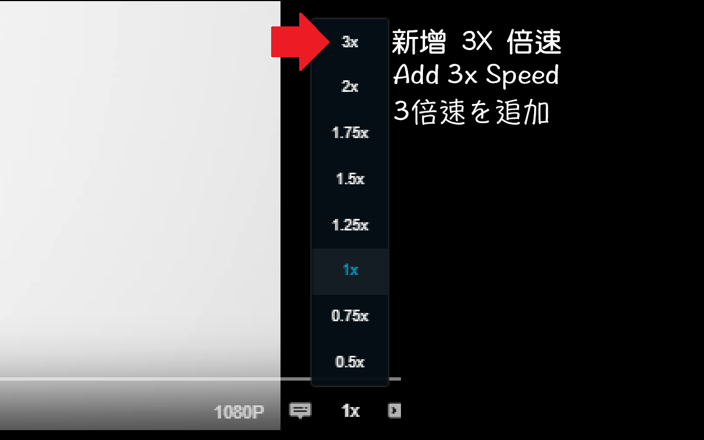

# [B.M] 動畫瘋 3X 倍速

[](https://developer.chrome.com/docs/extensions/mv3/)
[](https://ani.gamer.com.tw)
[](https://github.com/BoringMan314/bm-ani-gamer-3x)
[](LICENSE)

適用於 [巴哈姆特動畫瘋](https://ani.gamer.com.tw)（`ani.gamer.com.tw`）的瀏覽器擴充功能：在 HTML5 播放器的**播放速度**選單中新增 **3×** 選項，並將影片 `playbackRate` 設為 3。

*在巴哈姆特动画疯（`ani.gamer.com.tw`）的播放速度菜单中新增 **3×** 选项。*<br>
*Bahamut Anime Crazy（`ani.gamer.com.tw`）の再生速度メニューに **3×** オプションを追加します。*<br>
*Adds a **3×** option to the playback speed menu on Bahamut Anime Crazy (`ani.gamer.com.tw`).*

> **聲明**：本專案為第三方輔助工具，與動畫瘋／巴哈姆特官方無關。使用請遵守該站服務條款與著作權規範。

---



---

## 目錄

- [功能](#功能)
- [系統需求](#系統需求)
- [安裝方式](#安裝方式)
- [本機開發與測試](#本機開發與測試)
- [技術概要](#技術概要)
- [專案結構](#專案結構)
- [版本與多語系](#版本與多語系)
- [隱私說明](#隱私說明)
- [維護者：更新 GitHub 與 Chrome 線上應用程式商店](#維護者更新-github-與-chrome-線上應用程式商店)
- [授權](#授權)
- [問題與建議](#問題與建議)

---

## 功能

- 在 Video.js 播放器的倍速選單**最上方**加入 **3x**（外觀與站方內建項目一致）。
- 僅在 **`https://ani.gamer.com.tw/*`** 載入；`manifest` 未宣告 `host_permissions`，不額外請求其他網域。
- 若動畫瘋改版播放器 DOM，可能需調整 [`injected.js`](injected.js) 中的選取邏輯。

---

## 系統需求

- **Chrome** 或 **Microsoft Edge**（Chromium）等支援 **Manifest V3** 的瀏覽器。

---

## 安裝方式

### 從 Chrome 線上應用程式商店（建議）

請在 [Chrome Web Store](https://chromewebstore.google.com/) 搜尋 **「[[B.M] 動畫瘋 3X 倍速](https://chromewebstore.google.com/detail/bm-%E5%8B%95%E7%95%AB%E7%98%8B-3x-%E5%80%8D%E9%80%9F/kpfbkggjhfphppfhiabnjfomlaldcbij)」**，或直接點選連結前往商店頁面安裝。

### 從原始碼載入（開發人員模式）

1. 點選本頁綠色 **Code** → **Download ZIP** 解壓，或使用 Git 複製：`git clone https://github.com/BoringMan314/bm-ani-gamer-3x.git`。
2. 開啟 Chrome 或 Edge，前往 `chrome://extensions`（Edge：`edge://extensions`）。
3. 開啟「開發人員模式」→「載入未封裝項目」→ 選取含 [`manifest.json`](manifest.json) 的**專案根目錄**。
4. 開啟動畫瘋任一有影片的頁面，重新整理後即可在倍速選單確認 **3x**。

---

## 本機開發與測試

修改 `content.js` 或 `injected.js` 後，請在 `chrome://extensions` 針對本擴充點擊 **重新載入** 圖示，再重新整理動畫瘋分頁即可驗證變更。

---

## 技術概要

- **內容腳本** [`content.js`](content.js)：僅負責在符合網址的頁面插入 `<script src="…/injected.js">`，指令碼載入後即移除該標籤。
- **頁面脈絡** [`injected.js`](injected.js)：在網頁原生 JS 環境中執行，以便操作 Video.js 產生的選單 DOM，並對實際的 `<video>` 元素設定 `playbackRate`。

---

## 專案結構

| 路徑 | 說明 |
|------|------|
| [`manifest.json`](manifest.json) | Manifest V3 設定、內容腳本比對網址 |
| [`content.js`](content.js) | 注入頁面用的啟動腳本 |
| [`injected.js`](injected.js) | 建立 3× 選單項目並操作播放速率的核心邏輯 |
| [`_locales/`](_locales/) | 多語系支援（包含 `zh_TW`、`zh_CN`、`en`、`ja`） |
| [`privacy-policy.html`](privacy-policy.html) | 隱私權政策（上架商店所需之公開網頁） |
| [`icons/`](icons/) | 擴充功能圖示（16/48/128 px） |
| [`screenshot/`](screenshot/) | 商店與說明用截圖 |

**Chrome Web Store 常用截圖尺寸參考**：

| 檔案 | 用途 |
|------|------|
| `screenshot_440x280.png` | 小型宣傳圖 |
| `screenshot_1280x800.png` | 寬螢幕截圖 |
| `screenshot_1280x800.psd` | 寬螢幕截圖原始檔 (Photoshop) |
| `screenshot_1400x560.png` | 大型宣傳圖 |

---

## 版本與多語系

- **版本號**：定義於 [`manifest.json`](manifest.json) 的 `version`。
- **預設語系**：繁體中文 (`zh_TW`)。

---

## 隱私說明

本擴充功能**不蒐集、不上傳**任何個人資料或瀏覽記錄；未使用任何分析工具或遠端程式碼。詳細內容請參閱 [`privacy-policy.html`](privacy-policy.html)。

**上架提醒**：提交至 Chrome Web Store 時，須於後台填寫隱私實踐聲明，並提供該政策頁面的**公開 HTTPS 網址**（建議透過 [GitHub Pages](https://pages.github.com/) 託管）。

---

## 維護者：更新 GitHub 與 Chrome 線上應用程式商店

### 更新至 GitHub

**Bash / Git Bash / PowerShell：**

```powershell
git add .
git commit -m "docs: 更新內容說明與商店連結"
git push origin main
```

### 更新至 Chrome 線上應用程式商店

請透過 [Chrome Web Store 開發人員控制台](https://chrome.google.com/webstore/devconsole) 手動上傳更新：

1. **遞增版本**：修改 `manifest.json` 中的 `version`（例如從 `0.1.0` 提升至 `0.1.1`）。
2. **封裝套件**：將專案內容壓縮為 ZIP 檔。
   - **必要檔案**：`manifest.json`, `content.js`, `injected.js`, `privacy-policy.html`, `icons/`, `_locales/`。
   - **排除檔案**：`.git/`, `.gitignore`, `screenshot/`, `README.md`, `*.psd`, `*.zip`, `*.url`。
3. **上傳審核**：在控制台選擇項目 →「套件」→「上傳新套件」。
4. **提交送審**：檢查文案與截圖無誤後，點擊「提交送審」。

---

## 授權

本專案以 [MIT License](LICENSE) 授權。

---

## 問題與建議

歡迎透過 [GitHub Issues](https://github.com/BoringMan314/bm-ani-gamer-3x/issues) 回報錯誤或提出改善建議（回報時請提供瀏覽器版本與重現步驟）。
